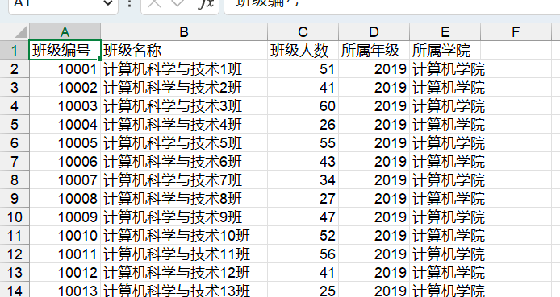
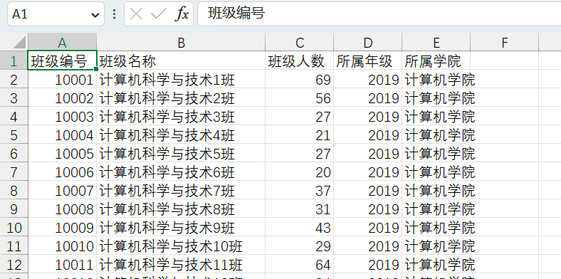
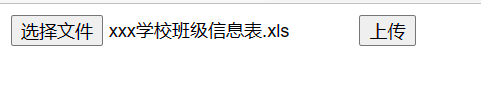
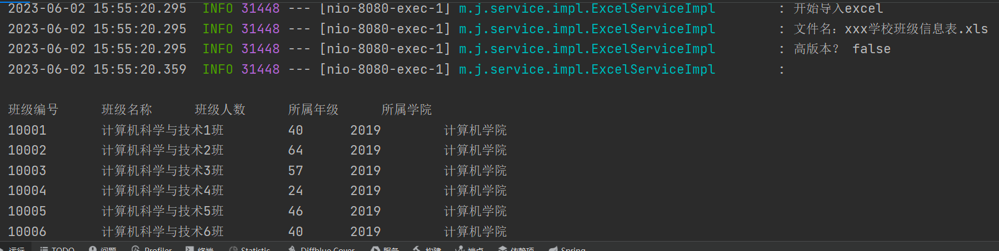
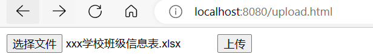
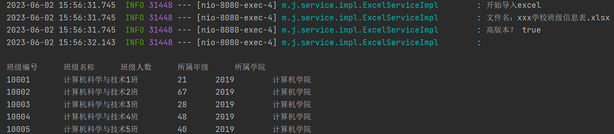

### web实现导出excel

创建spring boot 程序，pom文件依赖如下：

```xml
 <dependency>
            <groupId>org.springframework.boot</groupId>
            <artifactId>spring-boot-starter-web</artifactId>
        </dependency>

        <dependency>
            <groupId>org.projectlombok</groupId>
            <artifactId>lombok</artifactId>
            <optional>true</optional>
        </dependency>

        <dependency>
            <groupId>org.springframework.boot</groupId>
            <artifactId>spring-boot-starter-test</artifactId>
            <scope>test</scope>
        </dependency>

        <!--POI 操作excel 依赖-->
        <dependency>
            <groupId>org.apache.poi</groupId>
            <artifactId>poi</artifactId>
            <version>4.0.1</version>
        </dependency>

        <dependency>
            <groupId>org.apache.poi</groupId>
            <artifactId>poi-ooxml</artifactId>
            <version>4.0.1</version>
        </dependency>

        <dependency>
            <groupId>org.apache.poi</groupId>
            <artifactId>poi-ooxml-schemas</artifactId>
            <version>4.0.1</version>
        </dependency>
```


创建service接口

```java
package mao.java_report_web_poi_import_and_export_excel.service;

import org.springframework.web.multipart.MultipartFile;

import javax.servlet.http.HttpServletRequest;
import javax.servlet.http.HttpServletResponse;

/**
 * Project name(项目名称)：java_report_web_POI_import_and_export_excel
 * Package(包名): mao.java_report_web_poi_import_and_export_excel.service
 * Interface(接口名): ExcelService
 * Author(作者）: mao
 * Author QQ：1296193245
 * GitHub：https://github.com/maomao124/
 * Date(创建日期)： 2023/6/2
 * Time(创建时间)： 14:25
 * Version(版本): 1.0
 * Description(描述)： 无
 */

public interface ExcelService
{
    /**
     * 导出excel
     *
     * @param httpServletRequest  http servlet请求
     * @param httpServletResponse http servlet响应
     * @param highVersion         是否为高版本
     */
    void export(HttpServletRequest httpServletRequest, HttpServletResponse httpServletResponse, boolean highVersion);


    /**
     * 上传excel
     *
     * @param httpServletRequest  http servlet请求
     * @param httpServletResponse http servlet响应
     * @param multipartFile       多部分文件
     */
    void upload(MultipartFile multipartFile, HttpServletRequest httpServletRequest, HttpServletResponse httpServletResponse);
}
```


实现类：

```java
package mao.java_report_web_poi_import_and_export_excel.service.impl;

import lombok.SneakyThrows;
import lombok.extern.slf4j.Slf4j;
import mao.java_report_web_poi_import_and_export_excel.service.ExcelService;
import org.apache.poi.hssf.usermodel.HSSFWorkbook;
import org.apache.poi.ss.usermodel.Cell;
import org.apache.poi.ss.usermodel.Row;
import org.apache.poi.ss.usermodel.Sheet;
import org.apache.poi.ss.usermodel.Workbook;
import org.apache.poi.xssf.usermodel.XSSFWorkbook;
import org.springframework.stereotype.Service;
import org.springframework.web.multipart.MultipartFile;

import javax.servlet.http.HttpServletRequest;
import javax.servlet.http.HttpServletResponse;
import java.io.FileOutputStream;

/**
 * Project name(项目名称)：java_report_web_POI_import_and_export_excel
 * Package(包名): mao.java_report_web_poi_import_and_export_excel.service.impl
 * Class(类名): ExcelServiceImpl
 * Author(作者）: mao
 * Author QQ：1296193245
 * GitHub：https://github.com/maomao124/
 * Date(创建日期)： 2023/6/2
 * Time(创建时间)： 14:26
 * Version(版本): 1.0
 * Description(描述)： 无
 */

@Slf4j
@Service
public class ExcelServiceImpl implements ExcelService
{

    /**
     * 得到int随机
     *
     * @param min 最小值
     * @param max 最大值
     * @return int
     */
    public static int getIntRandom(int min, int max)
    {
        if (min > max)
        {
            min = max;
        }
        return min + (int) (Math.random() * (max - min + 1));
    }

    @SneakyThrows
    @Override
    public void export(HttpServletRequest httpServletRequest, HttpServletResponse httpServletResponse, boolean highVersion)
    {
        log.info("开始导出excel");

        //创建工作簿
        Workbook workbook = null;
        String fileName = null;
        //判断是否为高版本
        if (highVersion)
        {
            //高版本
            workbook = new XSSFWorkbook();
            fileName = "xxx学校班级信息表.xlsx";
        }
        else
        {
            //低版本
            workbook = new HSSFWorkbook();
            fileName = "xxx学校班级信息表.xls";
        }
        //创建工作表
        Sheet sheet = workbook.createSheet("班级信息");
        //创建行，第0行
        Row row = sheet.createRow(0);
        //创建单元格
        Cell cell = row.createCell(0);
        //填充数据
        cell.setCellValue("班级编号");
        //创建单元格
        cell = row.createCell(1);
        //填充数据
        cell.setCellValue("班级名称");
        //创建单元格
        cell = row.createCell(2);
        //填充数据
        cell.setCellValue("班级人数");
        //创建单元格
        cell = row.createCell(3);
        //填充数据
        cell.setCellValue("所属年级");
        //创建单元格
        cell = row.createCell(4);
        //填充数据
        cell.setCellValue("所属学院");

        //500行
        for (int i = 1; i < 500; i++)
        {
            //创建行，第i行
            row = sheet.createRow(i);
            //创建单元格
            cell = row.createCell(0);
            cell.setCellValue(10000 + i);

            cell = row.createCell(1);
            cell.setCellValue("计算机科学与技术" + i + "班");

            cell = row.createCell(2);
            cell.setCellValue(getIntRandom(20, 70));

            cell = row.createCell(3);
            cell.setCellValue(2019);

            cell = row.createCell(4);
            cell.setCellValue("计算机学院");
        }

        //请求头，设置附件（attachment）形式，设置文件名，并转换编码
        httpServletResponse.setHeader("Content-Disposition", "attachment;filename=" + new String(fileName.getBytes(), "ISO8859-1"));
        //设置请求类型，表格
        httpServletResponse.setContentType("application/vnd.openxmlformats-officedocument.spreadsheetml.sheet");
        //写入
        workbook.write(httpServletResponse.getOutputStream());
        //关闭
        workbook.close();
        log.info("导出完成");
    }

    @Override
    public void upload(MultipartFile multipartFile, HttpServletRequest httpServletRequest, HttpServletResponse httpServletResponse)
    {
        log.info("开始导入excel");
        //todo
    }
}
```


controller

```java
package mao.java_report_web_poi_import_and_export_excel.controller;

import lombok.extern.slf4j.Slf4j;
import mao.java_report_web_poi_import_and_export_excel.service.ExcelService;
import org.springframework.web.bind.annotation.GetMapping;
import org.springframework.web.bind.annotation.RequestMapping;
import org.springframework.web.bind.annotation.RequestParam;
import org.springframework.web.bind.annotation.RestController;
import org.springframework.web.multipart.MultipartFile;

import javax.annotation.Resource;
import javax.servlet.http.HttpServletRequest;
import javax.servlet.http.HttpServletResponse;

/**
 * Project name(项目名称)：java_report_web_POI_import_and_export_excel
 * Package(包名): mao.java_report_web_poi_import_and_export_excel.controller
 * Class(类名): ExcelController
 * Author(作者）: mao
 * Author QQ：1296193245
 * GitHub：https://github.com/maomao124/
 * Date(创建日期)： 2023/6/2
 * Time(创建时间)： 14:25
 * Version(版本): 1.0
 * Description(描述)： 无
 */


@Slf4j
@RestController
@RequestMapping("/excel")
public class ExcelController
{

    @Resource
    private ExcelService excelService;

    /**
     * 导出低版本excel
     */
    @RequestMapping("/export/low")
    public void exportLow(HttpServletRequest httpServletRequest, HttpServletResponse httpServletResponse)
    {
        excelService.export(httpServletRequest, httpServletResponse, false);
    }

    /**
     * 导出高版本excel
     */
    @RequestMapping("/export/high")
    public void exportHigh(HttpServletRequest httpServletRequest, HttpServletResponse httpServletResponse)
    {
        excelService.export(httpServletRequest, httpServletResponse, true);
    }

    /**
     * 上传excel
     */
    @RequestMapping("/upload")
    public void upload(@RequestParam("file") MultipartFile multipartFile, HttpServletRequest httpServletRequest, HttpServletResponse httpServletResponse)
    {
        excelService.upload(multipartFile, httpServletRequest, httpServletResponse);
    }
}

```


访问低版本下载地址：

http://localhost:8080/excel/export/low





访问高版本下载地址：

http://localhost:8080/excel/export/high





### web实现导入excel

实现upload方法

```java
package mao.java_report_web_poi_import_and_export_excel.service.impl;

import lombok.SneakyThrows;
import lombok.extern.slf4j.Slf4j;
import mao.java_report_web_poi_import_and_export_excel.service.ExcelService;
import org.apache.poi.hssf.usermodel.HSSFWorkbook;
import org.apache.poi.ss.usermodel.Cell;
import org.apache.poi.ss.usermodel.Row;
import org.apache.poi.ss.usermodel.Sheet;
import org.apache.poi.ss.usermodel.Workbook;
import org.apache.poi.xssf.usermodel.XSSFWorkbook;
import org.springframework.stereotype.Service;
import org.springframework.web.multipart.MultipartFile;

import javax.servlet.http.HttpServletRequest;
import javax.servlet.http.HttpServletResponse;
import java.io.FileOutputStream;

/**
 * Project name(项目名称)：java_report_web_POI_import_and_export_excel
 * Package(包名): mao.java_report_web_poi_import_and_export_excel.service.impl
 * Class(类名): ExcelServiceImpl
 * Author(作者）: mao
 * Author QQ：1296193245
 * GitHub：https://github.com/maomao124/
 * Date(创建日期)： 2023/6/2
 * Time(创建时间)： 14:26
 * Version(版本): 1.0
 * Description(描述)： 无
 */

@Slf4j
@Service
public class ExcelServiceImpl implements ExcelService
{

    /**
     * 得到int随机
     *
     * @param min 最小值
     * @param max 最大值
     * @return int
     */
    public static int getIntRandom(int min, int max)
    {
        if (min > max)
        {
            min = max;
        }
        return min + (int) (Math.random() * (max - min + 1));
    }

    @SneakyThrows
    @Override
    public void export(HttpServletRequest httpServletRequest, HttpServletResponse httpServletResponse, boolean highVersion)
    {
        log.info("开始导出excel");

        //创建工作簿
        Workbook workbook = null;
        String fileName = null;
        //判断是否为高版本
        if (highVersion)
        {
            //高版本
            workbook = new XSSFWorkbook();
            fileName = "xxx学校班级信息表.xlsx";
        }
        else
        {
            //低版本
            workbook = new HSSFWorkbook();
            fileName = "xxx学校班级信息表.xls";
        }
        //创建工作表
        Sheet sheet = workbook.createSheet("班级信息");
        //创建行，第0行
        Row row = sheet.createRow(0);
        //创建单元格
        Cell cell = row.createCell(0);
        //填充数据
        cell.setCellValue("班级编号");
        //创建单元格
        cell = row.createCell(1);
        //填充数据
        cell.setCellValue("班级名称");
        //创建单元格
        cell = row.createCell(2);
        //填充数据
        cell.setCellValue("班级人数");
        //创建单元格
        cell = row.createCell(3);
        //填充数据
        cell.setCellValue("所属年级");
        //创建单元格
        cell = row.createCell(4);
        //填充数据
        cell.setCellValue("所属学院");

        //500行
        for (int i = 1; i < 500; i++)
        {
            //创建行，第i行
            row = sheet.createRow(i);
            //创建单元格
            cell = row.createCell(0);
            cell.setCellValue(10000 + i);

            cell = row.createCell(1);
            cell.setCellValue("计算机科学与技术" + i + "班");

            cell = row.createCell(2);
            cell.setCellValue(getIntRandom(20, 70));

            cell = row.createCell(3);
            cell.setCellValue(2019);

            cell = row.createCell(4);
            cell.setCellValue("计算机学院");
        }

        //请求头，设置附件（attachment）形式，设置文件名，并转换编码
        httpServletResponse.setHeader("Content-Disposition", "attachment;filename=" + new String(fileName.getBytes(), "ISO8859-1"));
        //设置请求类型，表格
        httpServletResponse.setContentType("application/vnd.openxmlformats-officedocument.spreadsheetml.sheet");
        //写入
        workbook.write(httpServletResponse.getOutputStream());
        //关闭
        workbook.close();
        log.info("导出完成");
    }

    @SneakyThrows
    @Override
    public void upload(MultipartFile multipartFile, HttpServletRequest httpServletRequest, HttpServletResponse httpServletResponse)
    {
        //todo：全局异常处理

        if (multipartFile == null)
        {
            throw new RuntimeException("请上传文件");
        }

        log.info("开始导入excel");

        boolean highVersion;
        //得到文件名
        String filename = multipartFile.getOriginalFilename();
        log.info("文件名：" + filename);
        if (filename == null || filename.length() < 1)
        {
            throw new UnsupportedOperationException("无法读取文件名");
        }
        if (filename.endsWith(".xlsx"))
        {
            highVersion = true;
        }
        else if (filename.endsWith(".xls"))
        {
            highVersion = false;
        }
        else
        {
            throw new UnsupportedOperationException("文件后缀名不支持");
        }

        log.info("高版本？ " + highVersion);

        //加载工作簿
        Workbook workbook = null;
        if (highVersion)
        {
            workbook = new XSSFWorkbook(multipartFile.getInputStream());
        }
        else
        {
            workbook = new HSSFWorkbook(multipartFile.getInputStream());
        }
        //读取第一个工作表
        Sheet sheet = workbook.getSheetAt(0);
        //得到最后一行
        int lastRowNum = sheet.getLastRowNum();
        //得到第0行
        Row row = sheet.getRow(0);
        //校验表头
        String stringCellValue = row.getCell(0).getStringCellValue();
        if (!"班级编号".equals(stringCellValue))
        {
            throw new UnsupportedOperationException("表格格式不支持");
        }

        stringCellValue = row.getCell(1).getStringCellValue();
        if (!"班级名称".equals(stringCellValue))
        {
            throw new UnsupportedOperationException("表格格式不支持");
        }

        stringCellValue = row.getCell(2).getStringCellValue();
        if (!"班级人数".equals(stringCellValue))
        {
            throw new UnsupportedOperationException("表格格式不支持");
        }

        stringCellValue = row.getCell(3).getStringCellValue();
        if (!"所属年级".equals(stringCellValue))
        {
            throw new UnsupportedOperationException("表格格式不支持");
        }

        stringCellValue = row.getCell(4).getStringCellValue();
        if (!"所属学院".equals(stringCellValue))
        {
            throw new UnsupportedOperationException("表格格式不支持");
        }

        StringBuilder stringBuilder = new StringBuilder();

        stringBuilder.append("班级编号\t\t班级名称\t\t班级人数\t\t所属年级\t\t所属学院\n");

        //遍历读取数据
        for (int i = 1; i <= lastRowNum; i++)
        {
            //读取第i行
            row = sheet.getRow(i);
            //读取班级编号
            int classNo = ((Double) row.getCell(0).getNumericCellValue()).intValue();
            String className = null;
            try
            {
                //读取班级名称
                className = String.valueOf(((Double) row.getCell(1).getNumericCellValue()).intValue());
            }
            catch (IllegalStateException e)
            {
                className = row.getCell(1).getStringCellValue();
            }
            //读取班级人数
            int classCount = 0;
            try
            {
                classCount = ((Double) row.getCell(2).getNumericCellValue()).intValue();
            }
            catch (IllegalStateException e)
            {
                classCount = Integer.parseInt(row.getCell(2).getStringCellValue());
            }
            //读取所属年级
            int grade = ((Double) row.getCell(3).getNumericCellValue()).intValue();
            //读取所属学院
            String academy = row.getCell(4).getStringCellValue();
            stringBuilder.append(classNo).append("\t\t")
                    .append(className).append("\t\t")
                    .append(classCount).append("\t\t")
                    .append(grade).append("\t\t")
                    .append(academy)
                    .append('\n');
        }

        log.info("\n\n" + stringBuilder + "\t\t");

        log.info("导入完成");
    }
}

```


upload.html

```html
<!DOCTYPE html>
<html lang="en">
<head>
    <meta charset="UTF-8">
    <title>Title</title></head>
<body>
<form action="/excel/upload" method="post" enctype="multipart/form-data">
    <input type="file" name="file" value="请选择文件">
    <input type="submit" value="上传">
</form>
</body>
</html>
```


访问

http://localhost:8080/upload.html


上传低版本：







上传高版本：







